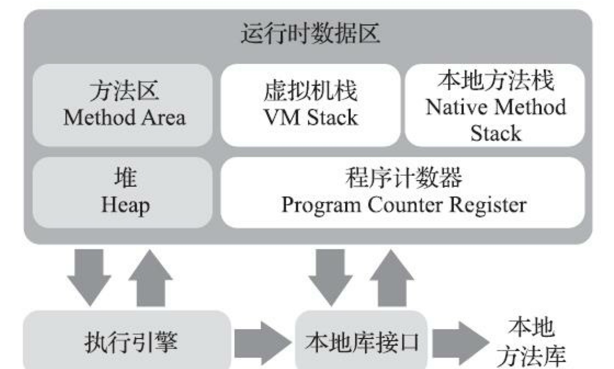
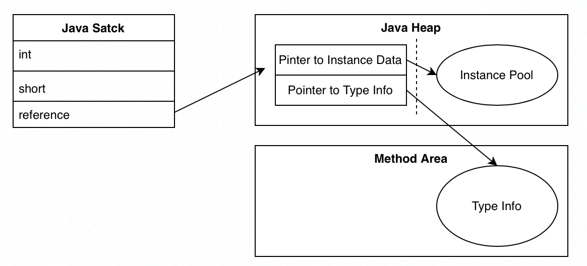
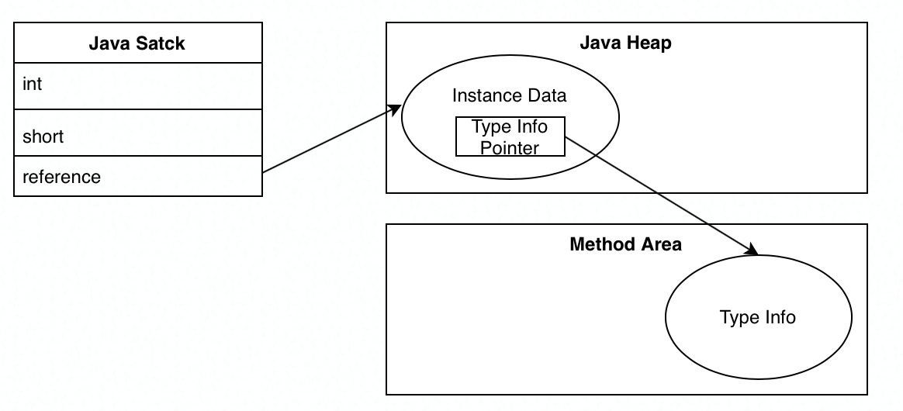
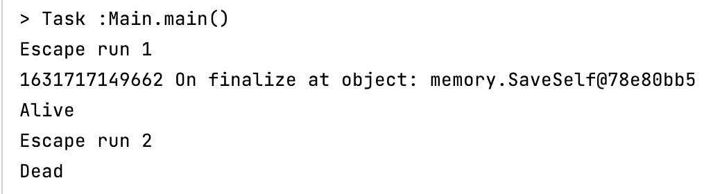

# JVM Memory 

## Java Memory Model

### Runtime Memory

JVM manages memory when Java app is running. Java runtime memory contains several individual areas, each have its own purpose and structure.

- **Program Counter**: Holds the address of the bytecode instruction that's currently running. When native code is running currently (and there is no java code running now), the PC will be set to undefined. Native code will not generate OOM.

- **VM Stack: ** JVM stack is thread-private, each method call will create a Stack Frame, which contains **local variable table**, operand stack, dynamic linkage... etc.  A local variable table contains primitive types, object reference and return address. It's possible to throw OOM when allocating new VM stack in thoery, yet in HotSpot implementation stack depth is fixed, only `StackOverFlowError` will occur.

- **Native Method Stacks: ** In standard, no further specifications for Native Method Stacks. Individual NMS is optional and not present in HotSpot.

- **Heap: ** Heap's sole purpose is to store object instances. Most of the object instances will stay in heaps besides few resides on stack ( thread-private only and is an optional optimization). Heap is where GC maily works with, and by garbage collectors' design, its structure differs. Most modern GC uses [Generational garbage collection](https://en.wikipedia.org/wiki/Tracing_garbage_collection#Generational_GC_(ephemeral_GC)) , thus heap normally has parts like young, old, eden, survivor. 

  Heap is basically shared between threads. In order to improve object-allocation efficiency, threre are multiple Thread-Local Allocation Buffer (TLAB) in heap.

  "Heaps can exist in incontiguous segements in memory", yet in most modern OSs, virtual memory will render this meaningless. Java Heap can be set as either fixed-size or extensive.

- **Method Area: ** Method Area contains *loaded* type (class) info, const value, static value, JIT cache. Its a part if heap, and usually called Permanent Generation (Not completely true). Method Area can be implemented as GC-comopatible or needs no GC. GC of this area involves constant pool and uninstall of loaded classes.



### Memory for Objects

#### When JVM is newing objects, what is it doing?

When the class is loaded,  size of the object will be determined. Then a corresponding size of memory will be allocated for the object. 

The allocating may not be thread-safe. Thus two strategies must be applied: synchronize memory allocation through locking, or ensure memory allocation happen thread-privately. In fact, two strategies will both take effect, and to implement the later, each thread have a Thread-Local Allocation Buffer (TLAB). You may check and enable this feature by `-xx +/-UseTLAB`. 

After memory allocation, JVM will do a bunch of work to ensure the object initialize properly, including finding its metadata, generate object header.

Then, JVM will invoke the class's `<init>()` to construct the specific object.

### Object Memory Layout

In HotSpot VM, an Object in memory consists of 3 parts: Header, Instance Data and Padding.

#### Header

A header is divided into two parts: Mark Word and Class Pointer.

Mark Word stores object's runtime data, including hash code, GC gnerational age, lock status. Lock status occupies lower 3-bits, and is defined as follow: 

```java
enum {  locked_value                 = 0, // 0 00 Lightweight locked
         unlocked_value           = 1,// 0 01 unlocked
         monitor_value            = 2,// 0 10 heavyweight locked
         marked_value             = 3,// 0 11 marked for gc
         biased_lock_pattern      = 5 // 1 01 biased locked
  };
```

Mark Word has a size of 32bit (In 32bit Systems) or 64bit (In 64bit Sysytems). 

In 64bit systems, Class Pointer can be either 32bit or 64bit by pointer compression settings. In Java 8 or later, pointer compression is on by default.

#### Instance Data

Including primitive types (1 Byte to 8 Bytes) and object pointers (4 Bytes if pointer compression is on, 8 Bytes off)

Object ordering will be combination of definition order and VM defualts: long/double, int, short/char, byte/boolean, Ordinary Object Pointers (OOPs).

#### Padding

JVM operates memory by 8 Bytes, thus if the object's size is not integral multiple of 8 Bytes, several bytes of padding will append to its end.

### Locating of Object 

From reference to object operations:

- Handle: Reference points to Handle pool in heap, whichi would point to Instance Pool and its Type Info respectively. Two pointer jumps in one access, lacks efficiency.



- Pointer: Direct access to Instance Data. But when modifying instance data's location, reference has to be updated.

  

HotSpot mainly uses the latter.

### OOMs

- Heap OOM: Most common, possibly related to  memory leak

- StackOverFlow

- Method Area and Constant Pool: Method Area OOM can be triggered when new classes generated at runtime, like `Enhancer` in Spring framework. After Java 7, constant pool is moved to heap. We can no longer create large amount of constants (like Strings) to cause method area OOM.

- Direct Memory Overflow: We can use Unsafe to allocate direct memory:

  ```java
  Field unsafeField = Unsafe.class.getDeclaredFields()[0];
  unsafeField.setAccessible(true);
  Unsafe usf  = (Unsafe) unsafeField.get(null);
  while(true){
  	usf.allocateMemory(1*MB);
  } 
  ```

## Garbage Collection

### Judgement

#### Reference Counting

Attach a reference counter to object and when its value reduces to zero, the object will be considered ready for GC. It is the most straightforward GC approach, and use by some runtimes like COM and Python, but not for JVM. In some senario like cyclic referencing, basic reference counting easily fails. In some implementation like CPython, uses cycle detection algorithms to detect cyclic references and collect it.

#### Reachability Analysis / Tracing

Tracing GC is the most common GC approach in modern programming languages. it uses Reachability Analysis. All objects that can reach a GC Root will considered to be alive, and all objects that can't reach one root will be marked for collection.

In Java, there are several GC Roots:

- References in stack frames.
- Static references in class. they resides in Method Area.
- JNI references
- References held by JVM itself, and classes which can't be GC-ed: Basic Types, ClassLoader, common errors (like `NullPointerException`).

Some modern garbage collectors has a feature "Partial GC". In this circumstance, some references of other parts will be added to partial GC Roots.

#### Reference Types

After JDK 1.2, Java Added `java.lang.ref` package and 4 different types of Reference.

- Strong Reference
- Soft Reference
- Weak Reference

- Phantom Reference

#### Death Sentence?

After reachablility analysis, all unreachable object will be sentence to probationary death. If the object has override method `finalize()` , it will be put into a F-queue, and JVM will trigger `finalize()` in another thread. Later, garbage collector will scan these objects again, if one has re-established reference with GC Roots, it will not be collected.

`finalize()` will only execute one time.



